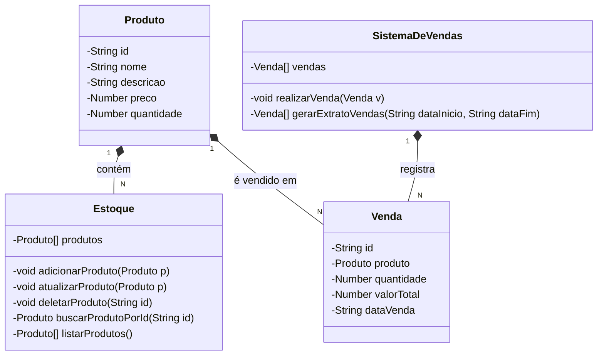

# 📦 Sistema de Gerenciamento de Estoque e Vendas

## 📌 Sobre o Projeto

Este é um sistema de gerenciamento de estoque e vendas desenvolvido com Java e Spring Boot, com deploy na plataforma Railway. O sistema permite cadastrar, atualizar, excluir e listar produtos no estoque, além de realizar vendas e gerar extratos de vendas de produtos.

## 🚀 Tecnologias Utilizadas

  
  
  
  

## 📂 Funcionalidades

### 🔹 Gerenciamento de Estoque

Adicionar um produto ➝ Cadastra um novo produto no banco de  dados.

Atualizar um produto ➝ Atualiza as informações de um produto existente.

Deletar um produto ➝ Remove um produto do banco de dados.

Listar todos os produtos ➝ Retorna a lista completa de produtos disponíveis.

Buscar produto por ID ➝ Retorna os detalhes de um produto específico.

### 🔹 Sistema de Vendas

Realizar uma venda ➝ Registra a venda de um produto, reduzindo a quantidade no estoque.

Gerar extrato de vendas ➝ Retorna todas as vendas realizadas em um período determinado.

 ## ↗️ MODELAGEM DO PROJETO 

## 🔧 Instalação e Configuração

### 1️⃣ Clonar o repositório

    git clone https://github.com/Igoreds/DecolaTech-API-Java

### 2️⃣ Configurar o Banco de Dados

O sistema utiliza H2 para testes. Não é necessário configurar PostgreSQL para rodar localmente.

### 3️⃣ Executar o projeto

    mvn spring-boot:run

A API estará rodando em http://localhost:8080.

## 📜 Documentação da API

A documentação completa pode ser acessada via Swagger após iniciar a aplicação:

http://localhost:8080/swagger-ui/index.html

## ☁️ Deploy no Railway

O projeto está implantado no Railway. Você pode acessá-lo em:

http://decolatech-api-java-production.up.railway.app/swagger-ui/index.html

### Desenvolvido por [Igor Silva](https://github.com/igoreds). 🧡

